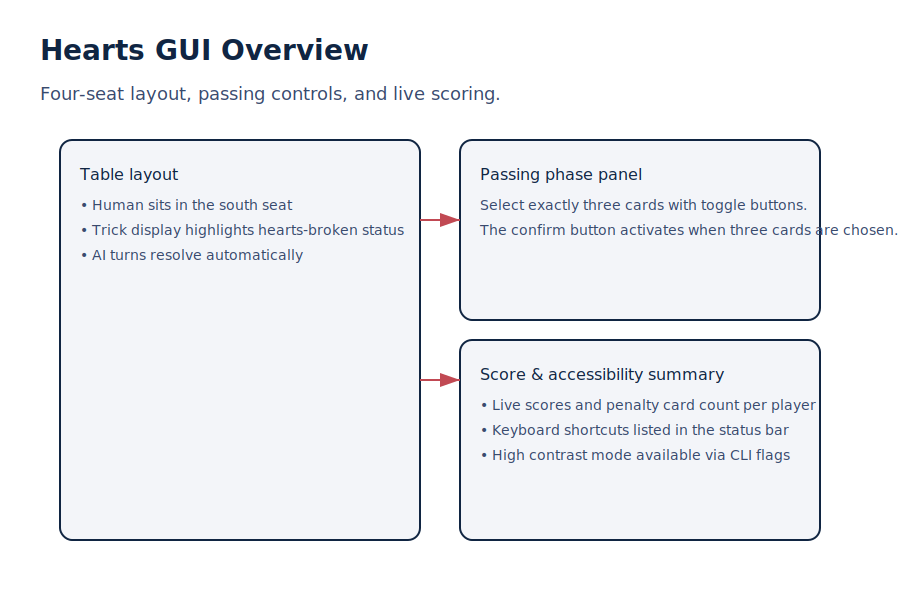

# Hearts

Trick-taking card game where the goal is to avoid taking hearts and the Queen of Spades, or to "shoot the moon" by
taking all penalty cards.

## How to Play

```bash
python -m card_games.hearts
```

Launching the module without flags opens the new PyQt5 GUI (falling back to Tkinter automatically when PyQt5 is not
available). The table presents a four-seat layout with the human player in the south seat, three AI opponents, and a
passing panel that lets you select exactly three cards before each round.



### Keyboard shortcuts & accessibility

- `Ctrl+L` focuses the action log so screen-reader users can review moves.
- `Ctrl+N` starts the next round once scoring is complete.
- `Ctrl+H` displays a summary of the available accessibility tools.
- Run `python -m card_games.hearts --high-contrast` for a high-contrast palette.
- Run `python -m card_games.hearts --accessibility-mode` to enable large fonts, screen-reader labelling, and focus
  indicators.

The scoreboard updates in real time, displaying both total scores and the number of penalty cards (“bags”) captured
during the current hand.

### Command-line mode

If you prefer the original text interface, pass `--cli`:

```bash
python -m card_games.hearts --cli
```

Additional optional flags:

- `--player-name <name>` – customise the human player label in either interface.
- `--high-contrast` – enable a theme with bold colours and higher contrast.
- `--accessibility-mode` – enable large fonts plus screen-reader annotations.
- `--backend {pyqt,tk}` – choose a GUI backend explicitly.

## Game Rules

- Four players compete individually
- Each player is dealt 13 cards
- Before each hand, players pass 3 cards in rotating directions (left, right, across, none)
- Players must follow suit if possible
- Opening trick must start with the 2♣ and cannot contain penalty cards unless unavoidable
- Hearts may not be led until they are "broken" by a heart discard or the queen of spades
- Hearts and the Queen of Spades are penalty cards (1 and 13 points respectively)
- **Shooting the Moon**: Taking all hearts AND the Queen of Spades gives 0 points to you and 26 to everyone else
- **Shooting the Sun**: Winning every trick in a hand is recorded as a special achievement
- First player to reach 100 points loses

## Features

- Pass-the-cards mechanic with rotating directions and historical tracking
- Strict opening-trick rule enforcement and automatic heart-breaking logic
- Trick history and round summaries, including moon/sun achievements
- AI opponents that prioritise voiding suits, unloading penalty cards, and leading safe tricks
- Full trick-taking rules implementation with realistic scoring
