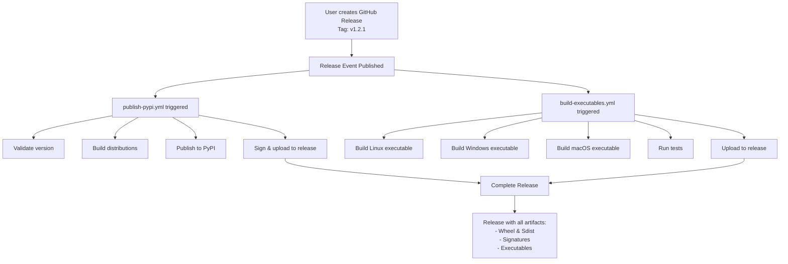
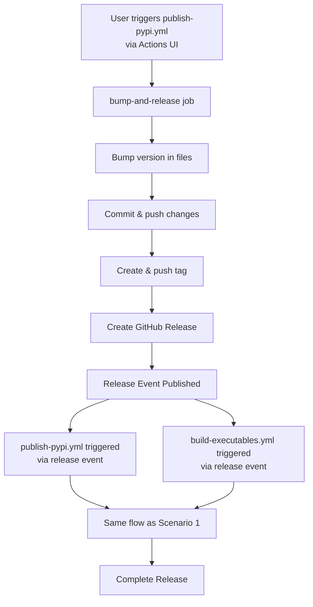
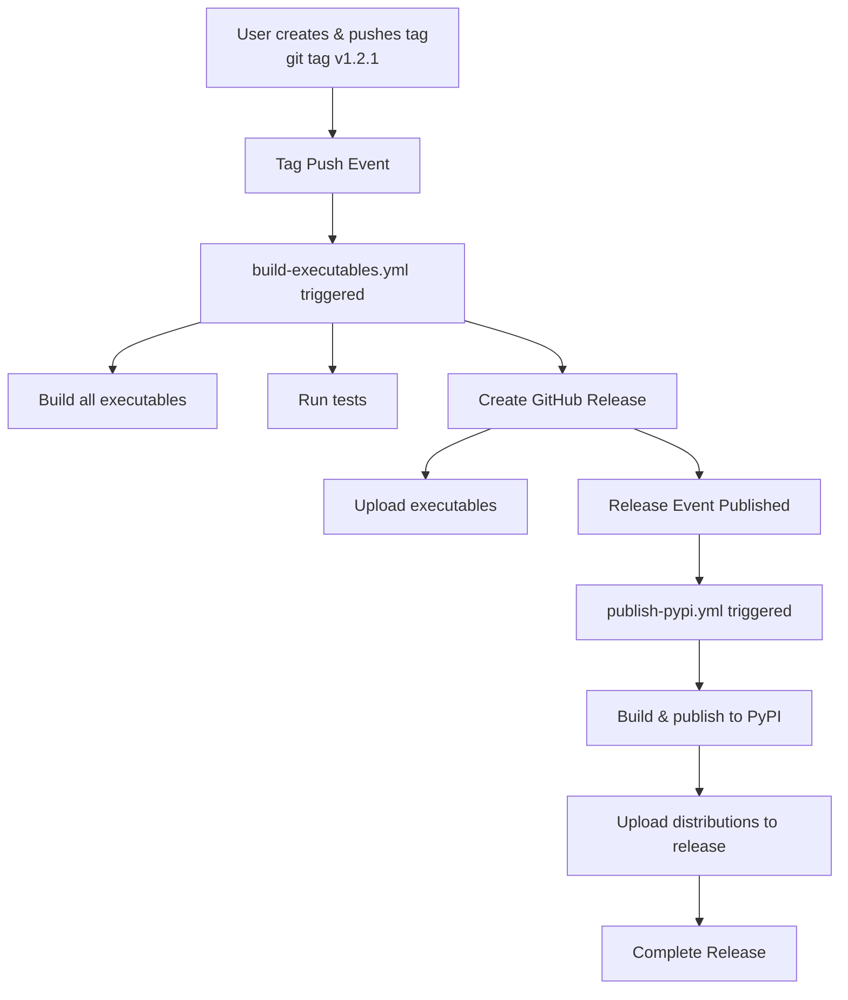

# Workflow Coordination Guide

## Overview

As of v1.2.1, the release process uses two coordinated GitHub Actions workflows that trigger on the same release event to provide a complete release with PyPI package and platform-specific executables.

## Workflows

### 1. `publish-pypi.yml` - PyPI Publishing

**Purpose:** Build and publish Python package to PyPI

**Triggers:**

- Release events (when a release is published)
- Manual workflow dispatch (with optional version bump)

**Jobs:**

1. `bump-and-release` (only on workflow_dispatch)

   - Bumps version
   - Commits changes
   - Creates tag and release

1. `validate-version` (only on release events)

   - Validates version consistency across files
   - Ensures tag matches version

1. `build`

   - Builds wheel and source distribution
   - Runs smoke tests

1. `publish-to-pypi`

   - Publishes to PyPI using trusted publishing (OIDC)

1. `github-release`

   - Signs packages with Sigstore
   - Uploads wheel, sdist, and signatures to GitHub Release

### 2. `build-executables.yml` - Executable Building

**Purpose:** Build standalone executables for all platforms

**Triggers:**

- Push to master/main branches (builds only)
- Push to tags matching `v*` (builds and creates release)
- **Release events (when a release is published)** ← Added in v1.2.1
- Pull requests (validation only)
- Manual workflow dispatch

**Jobs:**

1. `build-pyinstaller`

   - Builds executables for Linux, Windows, macOS
   - Validates executable exists
   - Runs smoke tests
   - Uploads artifacts

1. `cross-platform-tests`

   - Tests imports across platforms and Python versions

1. `docker-build`

   - Builds and tests Docker image

1. `create-release`

   - Creates or updates GitHub Release
   - Uploads all executables

## Coordination Flow

### Scenario 1: Manual Release Creation



**Steps:**

1. User navigates to GitHub and creates a new release with tag `v1.2.1`
1. GitHub publishes the release
1. Both workflows trigger simultaneously:
   - `publish-pypi.yml` validates, builds, publishes to PyPI, signs, and uploads distributions
   - `build-executables.yml` builds all executables and uploads them
1. After ~10-15 minutes, the release contains all artifacts

### Scenario 2: Automated Workflow Dispatch



**Steps:**

1. User goes to Actions → Publish to PyPI → Run workflow
1. Selects version bump type (major/minor/patch)
1. `bump-and-release` job:
   - Bumps version in `pyproject.toml` and `scripts/__init__.py`
   - Commits and pushes changes
   - Creates and pushes tag
   - Creates GitHub Release
1. Release creation triggers both workflows (same as Scenario 1)
1. Complete release with all artifacts

### Scenario 3: Manual Tag Push (Legacy)



**Note:** This scenario still works but is not the recommended approach. Prefer Scenario 1 or 2.

## Artifact Types

After a successful coordinated release, the GitHub Release will contain:

### From `publish-pypi.yml`:

- `games_collection-X.Y.Z-py3-none-any.whl` - Python wheel
- `games_collection-X.Y.Z.tar.gz` - Source distribution
- `games_collection-X.Y.Z-py3-none-any.whl.sigstore` - Wheel signature
- `games_collection-X.Y.Z.tar.gz.sigstore` - Sdist signature

### From `build-executables.yml`:

- `games-collection` (Linux) - Standalone executable for Linux
- `games-collection.exe` (Windows) - Standalone executable for Windows
- `games-collection` (macOS) - Standalone executable for macOS

### Total: 7 files

All artifacts are in a single GitHub Release, making it easy for users to download what they need.

## Timeline

Typical workflow completion times:

| Workflow | Duration | Parallelizable |
|----------|----------|----------------|
| `publish-pypi.yml` validate | ~1 min | Yes |
| `publish-pypi.yml` build | ~2 min | Yes |
| `publish-pypi.yml` publish | ~1 min | No (after build) |
| `publish-pypi.yml` sign & upload | ~1 min | No (after publish) |
| `build-executables.yml` build | ~5-8 min | Yes (3 platforms) |
| `build-executables.yml` tests | ~3-5 min | Yes (12 combinations) |
| `build-executables.yml` upload | ~1 min | No (after build) |
| **Total** | **~10-15 min** | |

Both workflows run in parallel, so total time is approximately the duration of the longest workflow (build-executables.yml).

## Conflict Resolution

### Won't Both Workflows Create the Same Release?

No. Here's how it works:

1. **Manual Release Creation (Recommended):**

   - User creates release → both workflows triggered
   - `publish-pypi.yml` uploads distributions
   - `build-executables.yml` uploads executables
   - `softprops/action-gh-release@v2` and `gh release upload` both update existing releases

1. **Automated Workflow (workflow_dispatch):**

   - `bump-and-release` creates release
   - Release event triggers both workflows
   - Same behavior as above

1. **Manual Tag Push (Legacy):**

   - Tag push triggers `build-executables.yml`
   - It creates the release
   - Release event triggers `publish-pypi.yml`
   - It updates the existing release

In all cases, the GitHub Actions `softprops/action-gh-release` action and `gh release upload` command are smart enough to update existing releases rather than failing when a release already exists.

### What About Race Conditions?

GitHub's release API handles concurrent uploads gracefully:

- Each workflow uploads different files
- File uploads are atomic operations
- No conflicts occur because file names are unique

## Benefits of Coordination

### ✅ Single Command Release

Create a release once, get everything:

- PyPI package published
- Executables built
- All artifacts in one place

### ✅ Consistency

Both workflows use the same version from the release tag, ensuring consistency.

### ✅ Reliability

If one workflow fails, the other still completes. You can re-run failed workflows independently.

### ✅ Visibility

Both workflows appear in the Actions tab, making it easy to monitor progress and debug issues.

### ✅ No Manual Coordination

No need to remember to trigger both workflows or upload artifacts manually.

## Troubleshooting

### Both Workflows Don't Trigger

**Symptom:** Only one workflow runs when release is created.

**Cause:** The workflow file might not be on the ref (tag) being released.

**Solution:** Ensure changes to `.github/workflows/build-executables.yml` are committed and pushed before creating the release.

### Executables Not Uploaded

**Symptom:** `publish-pypi.yml` completes but no executables in release.

**Cause:** `build-executables.yml` might have failed.

**Solution:**

1. Check Actions tab for `build-executables.yml` run
1. Review logs for errors
1. Re-run the workflow if needed

### PyPI Upload Fails

**Symptom:** `build-executables.yml` completes but PyPI doesn't have the package.

**Cause:** `publish-pypi.yml` might have failed.

**Solution:**

1. Check Actions tab for `publish-pypi.yml` run
1. Common issues:
   - Version already exists on PyPI (can't overwrite)
   - PyPI trusted publishing not configured
   - Environment `pypi` not configured
1. Fix the issue and re-run the workflow

### Release Has Duplicate Files

**Symptom:** Release has multiple copies of the same file.

**Cause:** Workflow was run multiple times.

**Solution:**

1. Delete duplicate files manually via GitHub UI
1. Or delete entire release and recreate

## Best Practices

### 1. Use Manual Release Creation

For maximum control and visibility, create releases manually via GitHub UI. This makes it clear when you're releasing.

### 2. Update CHANGELOG First

Before creating a release, update `CHANGELOG.md` with release notes. You can copy these into the release description.

### 3. Test Locally First

Run tests and builds locally before creating the release:

```bash
pytest tests/
python -m build
./scripts/build_executable.sh
```

### 4. Monitor Both Workflows

After creating a release, watch both workflows in the Actions tab to ensure they complete successfully.

### 5. Verify the Release

After workflows complete, verify:

- PyPI has the new version
- All artifacts are in the GitHub Release
- Executables work when downloaded

## Future Enhancements

Potential improvements to the coordination system:

1. **Unified Workflow:** Combine both workflows into a single workflow file (more complex but simpler to manage)
1. **Notification Job:** Add a final job that notifies when the full release is complete
1. **Rollback Mechanism:** Automatically rollback PyPI publish if executable builds fail
1. **Version Validation:** Cross-check version between workflows before uploading

## Related Documentation

- [PYPI_RELEASE.md](PYPI_RELEASE.md) - Complete PyPI release process
- [BUILD_EXECUTABLES_WORKFLOW.md](../development/BUILD_EXECUTABLES_WORKFLOW.md) - Executable building details
- [PYPI_PUBLISHING_GUIDE.md](../development/PYPI_PUBLISHING_GUIDE.md) - Technical workflow details

______________________________________________________________________

**The coordination system is designed to be robust, reliable, and easy to use. Just create a release and let the workflows do the rest!**
