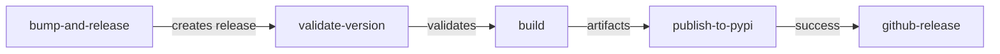

# PyPI Publishing Guide

This guide explains how to properly publish releases to PyPI using the automated workflow.

______________________________________________________________________

## Table of Contents

- [Overview](#overview)
- [Prerequisites](#prerequisites)
- [Publishing Process](#publishing-process)
- [Workflow Details](#workflow-details)
- [Version Management](#version-management)
- [Validation](#validation)
- [Troubleshooting](#troubleshooting)
- [Common Mistakes](#common-mistakes)

______________________________________________________________________

## Overview

The `publish-pypi.yml` workflow automates the entire release process:

1. **Version Bumping:** Automatically increments version numbers
1. **Validation:** Ensures version consistency across files
1. **Building:** Creates distribution packages (wheel and sdist)
1. **Testing:** Runs smoke tests on built packages
1. **Publishing:** Uploads to PyPI using trusted publishing (OIDC)
1. **Signing:** Signs packages with Sigstore and uploads to GitHub Release

**Key Features:**

- ✅ Automated version management
- ✅ Version consistency validation
- ✅ Fail-fast error detection
- ✅ No secrets required (uses OIDC)
- ✅ Cryptographic signing with Sigstore

______________________________________________________________________

## Prerequisites

### For Publishing

1. **PyPI Account:** Configured with trusted publishing
1. **GitHub Environment:** `pypi` environment configured in repository settings
1. **Permissions:** Write access to the repository

### For Development

1. **Python 3.9+:** Installed locally
1. **Git:** Configured with your GitHub account
1. **Repository Clone:** Fresh clone of the repository

______________________________________________________________________

## Publishing Process

### Method 1: Automated (Recommended)

Use the workflow's built-in version bumping:

1. **Go to GitHub Actions:**

   - Navigate to: `Actions` > `Publish to PyPI`
   - Click: `Run workflow`

1. **Configure the Run:**

   - **Branch:** Select `master` (or `main`)
   - **Bump Version:** Choose version increment:
     - `patch` → 1.0.0 → 1.0.1 (bug fixes)
     - `minor` → 1.0.0 → 1.1.0 (new features, backwards compatible)
     - `major` → 1.0.0 → 2.0.0 (breaking changes)

1. **Start Workflow:**

   - Click `Run workflow` button
   - Workflow will:
     - ✅ Bump version in `pyproject.toml` and `scripts/__init__.py`
     - ✅ Commit the version bump
     - ✅ Create and push a git tag (e.g., `v1.0.1`)
     - ✅ Create a GitHub Release
     - ✅ Trigger build and publish automatically

1. **Monitor Progress:**

   - Watch the workflow execution
   - Check for any errors
   - Verify release appears on PyPI

**That's it!** The entire process is automated.

### Method 2: Manual (Not Recommended)

Only use this if the automated workflow is unavailable:

```bash
# 1. Update version in files
sed -i 's/version = "1.0.0"/version = "1.0.1"/' pyproject.toml
sed -i 's/__version__ = "1.0.0"/__version__ = "1.0.1"/' scripts/__init__.py

# 2. Validate consistency
python scripts/check_version_consistency.py --tag v1.0.1

# 3. Commit and push
git add pyproject.toml scripts/__init__.py
git commit -m "chore: bump version to 1.0.1"
git push

# 4. Create and push tag
git tag -a v1.0.1 -m "Release v1.0.1"
git push origin v1.0.1

# 5. Create GitHub Release (via UI or gh CLI)
gh release create v1.0.1 --title "v1.0.1" --notes "Release notes here"

# Workflow will automatically build and publish to PyPI
```

______________________________________________________________________

## Workflow Details

### Jobs Overview



### Job Descriptions

#### 1. bump-and-release (workflow_dispatch only)

**Purpose:** Automate version bumping and release creation

**When:** Only runs on manual workflow dispatch

**Steps:**

1. Checkout repository
1. Bump version using `scripts/bump_version.py`
1. Commit version changes
1. Create and push git tag
1. Create GitHub Release

**Output:** Triggers a new release event, starting the publish pipeline

#### 2. validate-version (release event only)

**Purpose:** Ensure version consistency before building

**When:** Only runs on release events (not workflow_dispatch)

**Validation Checks:**

- ✅ `pyproject.toml` version matches git tag
- ✅ `scripts/__init__.py` version matches git tag
- ✅ Both version files are in sync

**On Failure:** Workflow stops immediately with clear error message

**Script:** Uses `scripts/check_version_consistency.py`

#### 3. build

**Purpose:** Build distribution packages

**Depends On:** validate-version (must pass or be skipped)

**Steps:**

1. Checkout repository
1. Install build dependencies
1. Build packages: `python -m build`
1. Run smoke tests on built wheel
1. Upload artifacts

**Output:**

- `games_collection-X.Y.Z-py3-none-any.whl` (wheel)
- `games_collection-X.Y.Z.tar.gz` (source distribution)

#### 4. publish-to-pypi

**Purpose:** Upload packages to PyPI

**Depends On:** build (must succeed)

**When:** Only on release events

**Authentication:** Uses PyPI trusted publishing (OIDC) - no secrets needed

**Steps:**

1. Download build artifacts
1. Publish to PyPI using `pypa/gh-action-pypi-publish`

**On Failure:** Common causes:

- Version already exists on PyPI (can't overwrite)
- PyPI trusted publishing not configured
- Package validation failed

#### 5. github-release

**Purpose:** Sign packages and upload to GitHub Release

**Depends On:** publish-to-pypi (must succeed)

**Steps:**

1. Download build artifacts
1. Check for existing release assets
1. Sign packages with Sigstore
1. Upload signed packages to GitHub Release

______________________________________________________________________

## Version Management

### Version Files

Two files must be kept in sync:

1. **pyproject.toml:**

   ```toml
   [project]
   version = "1.0.1"
   ```

1. **scripts/\_\_init\_\_.py:**

   ```python
   __version__ = "1.0.1"
   ```

### Version Scheme

Follow [Semantic Versioning](https://semver.org/):

- **Major (X.0.0):** Breaking changes, incompatible API changes
- **Minor (0.X.0):** New features, backwards compatible
- **Patch (0.0.X):** Bug fixes, backwards compatible

### Automated Bumping

The `scripts/bump_version.py` script:

- Reads current version from `pyproject.toml`
- Increments the specified part (major/minor/patch)
- Updates both version files atomically
- Ensures consistency

### Manual Bumping

If you need to update versions manually:

```bash
# Example: Bump to 1.2.3
sed -i 's/version = ".*"/version = "1.2.3"/' pyproject.toml
sed -i 's/__version__ = ".*"/__version__ = "1.2.3"/' scripts/__init__.py

# Validate
python scripts/check_version_consistency.py
```

______________________________________________________________________

## Validation

### Local Validation

Before creating a release, validate version consistency:

```bash
# Check current versions
python scripts/check_version_consistency.py

# Check against a specific tag
python scripts/check_version_consistency.py --tag v1.2.3
```

**Output (Success):**

```
Version Check Results:
  pyproject.toml: 1.2.3
  scripts/__init__.py: 1.2.3
  Git tag: 1.2.3

✅ Version Consistency Check PASSED
   All versions match: 1.2.3
```

**Output (Failure):**

```
Version Check Results:
  pyproject.toml: 1.2.3
  scripts/__init__.py: 1.2.2
  Git tag: 1.2.3

❌ Version Consistency Check FAILED:
  • Version mismatch: Git tag (1.2.3) != scripts/__init__.py (1.2.2)
```

### CI Validation

The workflow automatically validates versions on every release:

- Runs before building packages
- Prevents mismatched versions from being published
- Provides clear error messages in workflow logs

______________________________________________________________________

## Troubleshooting

### Issue: "File already exists" on PyPI

**Symptom:**

```
HTTPError: 400 Bad Request
File already exists ('games_collection-1.0.1-py3-none-any.whl', ...)
```

**Cause:** Version 1.0.1 is already published on PyPI

**Solutions:**

1. **Bump to new version:**

   ```bash
   # Use workflow to bump to 1.0.2
   # Or manually bump and re-release
   ```

1. **Don't reuse version numbers** - PyPI prevents this for security

**Prevention:** Use the automated workflow to avoid version conflicts

### Issue: Version validation fails

**Symptom:**

```
❌ Version Consistency Check FAILED:
  • Version mismatch: Git tag (v1.1.1) != pyproject.toml (1.0.1)
```

**Cause:** Git tag and code versions don't match

**Solutions:**

1. **Delete and recreate tag:**

   ```bash
   git tag -d v1.1.1
   git push --delete origin v1.1.1
   # Update versions in code
   # Create new tag
   ```

1. **Use correct workflow:**

   - Use workflow_dispatch to bump version
   - Don't create tags manually

**Prevention:** Always use the automated workflow for releases

### Issue: Build job skipped

**Symptom:** Build job shows as "skipped" in workflow

**Cause:** Version validation failed

**Solution:**

1. Check validation job logs
1. Fix version mismatches
1. Re-run workflow or recreate release

### Issue: PyPI trusted publishing fails

**Symptom:**

```
Error: PyPI trusted publishing authentication failed
```

**Cause:** PyPI not configured for trusted publishing

**Solution:**

1. Go to PyPI.org > Account Settings > Publishing
1. Add GitHub repository with environment name `pypi`
1. Re-run workflow

______________________________________________________________________

## Common Mistakes

### ❌ Creating tags manually

**Wrong:**

```bash
git tag v1.0.1
git push origin v1.0.1
gh release create v1.0.1
```

**Problem:** Skips version bumping, may point to wrong commit

**Right:** Use workflow_dispatch to automate the entire process

### ❌ Creating releases via GitHub UI

**Wrong:** Using "Draft a new release" in GitHub UI without version bump

**Problem:** Tag points to old version in code

**Right:** Use workflow_dispatch to create release programmatically

### ❌ Editing version in only one file

**Wrong:**

```bash
# Only updating pyproject.toml
sed -i 's/version = "1.0.0"/version = "1.0.1"/' pyproject.toml
```

**Problem:** Files get out of sync

**Right:** Use `scripts/bump_version.py` or update both files

### ❌ Reusing version numbers

**Wrong:** Trying to re-publish version 1.0.1 after it exists

**Problem:** PyPI rejects duplicate versions

**Right:** Always bump to a new version

______________________________________________________________________

## Quick Reference

### Publish a new release

```bash
# Option 1: Via GitHub UI
# Actions > Publish to PyPI > Run workflow > Select bump type > Run

# Option 2: Via gh CLI
gh workflow run publish-pypi.yml -f bump_part=patch
```

### Check version consistency

```bash
python scripts/check_version_consistency.py
```

### Validate against tag

```bash
python scripts/check_version_consistency.py --tag v1.2.3
```

### View current version

```bash
grep 'version = ' pyproject.toml
grep '__version__ = ' scripts/__init__.py
```

### Clean up failed release

```bash
# Delete release (GitHub UI or gh CLI)
gh release delete v1.0.1 --yes

# Delete tag
git push --delete origin v1.0.1
git tag -d v1.0.1
```

______________________________________________________________________

## Related Documentation

- [Workflow Source](../../.github/workflows/publish-pypi.yml)
- [Version Checker](../../scripts/check_version_consistency.py)
- [Version Bumper](../../scripts/bump_version.py)
- [Debug Report](../workflows/PYPI_PUBLISH_DEBUG_RUN_18520989869.md)
- [PyPI Trusted Publishing](https://docs.pypi.org/trusted-publishers/)
- [Semantic Versioning](https://semver.org/)

______________________________________________________________________

## Best Practices

1. ✅ **Always use automated workflow** for version bumps and releases
1. ✅ **Validate locally** before creating releases
1. ✅ **Follow semantic versioning** for version numbers
1. ✅ **Write clear release notes** describing changes
1. ✅ **Test in a Python virtual environment** after publishing
1. ✅ **Monitor workflow execution** for any errors
1. ✅ **Document breaking changes** in CHANGELOG.md

______________________________________________________________________

**Last Updated:** 2025-10-15\
**Workflow Version:** publish-pypi.yml v2 (with validation)
