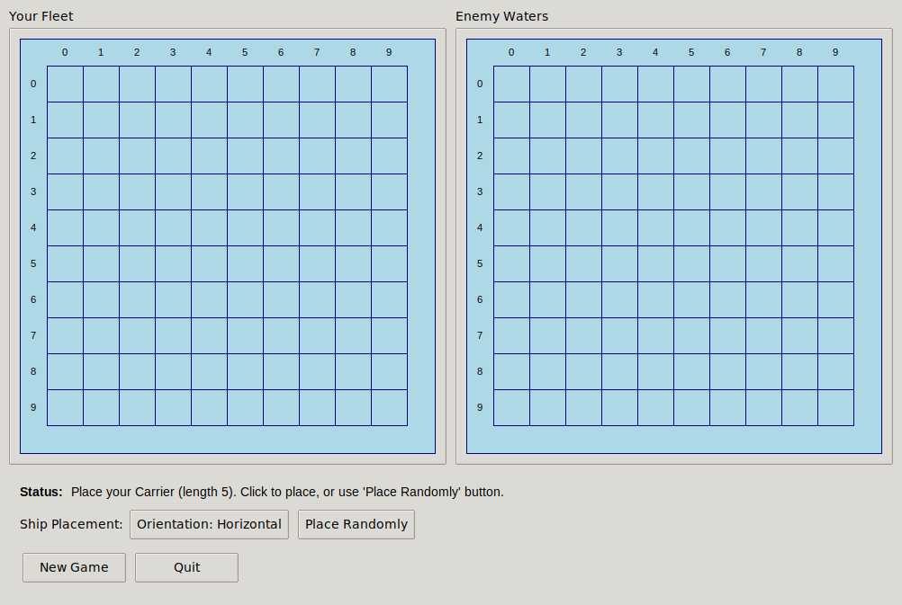
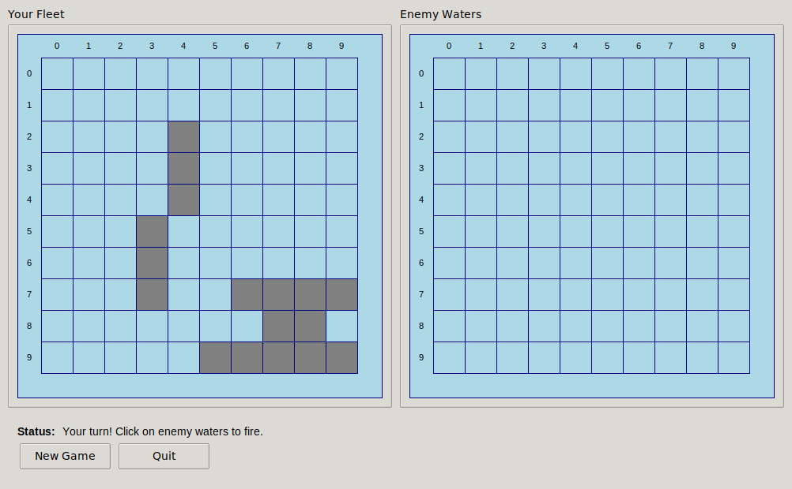

# Battleship GUI

A graphical user interface for the Battleship game with drag-and-drop ship placement.

## Features

- **Interactive ship placement**: Click on the board to place ships or use the "Place Randomly" button
- **Visual feedback**: Clear display of hits, misses, and sunk ships
- **Multiple board sizes**: 8x8 and 10x10 grids
- **Fleet configurations**: Choose from small, default, or extended fleets
- **AI difficulty levels**: Easy, medium, and hard AI opponents
- **2-player hot-seat mode**: Play against a friend on the same computer
- **Salvo mode**: Multiple shots per turn based on remaining ships
- **Orientation toggle**: Switch between horizontal and vertical ship placement

## Usage

### From Command Line

Run the GUI with default settings (10x10 board, default fleet, medium AI):

```bash
python -m paper_games.battleship.gui
```

Or with custom options:

```bash
python -m paper_games.battleship.gui --size 8 --fleet small --difficulty hard
```

### Available Options

- `--size {8,10}`: Board size (default: 10)
- `--fleet {small,default,extended}`: Fleet configuration (default: default)
- `--difficulty {easy,medium,hard}`: AI difficulty level (default: medium)
- `--two-player`: Enable 2-player hot-seat mode
- `--salvo`: Enable salvo mode (multiple shots per turn)
- `--seed SEED`: Random seed for reproducible games

### From Python Code

```python
from paper_games.battleship import run_gui

# Run with default settings
run_gui()

# Run with custom settings
run_gui(size=8, fleet="small", difficulty="hard", salvo=True)
```

## How to Play

### Ship Placement Phase

1. The game starts with ship placement. You'll see your fleet board on the left.
2. Click on the board to place each ship, or use the "Place Randomly" button for automatic placement.
3. Use the "Orientation" button to toggle between horizontal and vertical placement.
4. Ships will show as a green preview before placement. Invalid placements won't show a preview.

### Gameplay Phase

1. After ship placement, the game begins.
2. Click on the enemy waters (right board) to fire at the opponent.
3. Blue circles (○) indicate misses, red X marks (✗) indicate hits.
4. Your fleet (left board) shows your ships in gray and tracks enemy hits.
5. In salvo mode, you can fire multiple shots per turn equal to your remaining ships.
6. The game continues until all ships of one player are sunk.

## Fleet Configurations

### Small Fleet (recommended for 8x8)
- Battleship (4)
- Cruiser (3)
- Submarine (3)
- Destroyer (2)

### Default Fleet
- Carrier (5)
- Battleship (4)
- Cruiser (3)
- Submarine (3)
- Destroyer (2)

### Extended Fleet (recommended for 10x10)
- Carrier (5)
- Battleship (4)
- Cruiser (3)
- Submarine (3)
- Destroyer (2)
- Patrol Boat (2)
- Frigate (3)

## AI Difficulty Levels

- **Easy**: Random shooting strategy
- **Medium**: 70% chance of using smart hunting strategy, 30% random
- **Hard**: Always uses smart hunting strategy with target prioritization

## Screenshots

### Ship Placement Phase


### Gameplay


## Requirements

- Python 3.8+
- tkinter (usually included with Python)
- PIL/Pillow (for screenshots only, not required for gameplay)

## Technical Details

The GUI is built using tkinter and follows the same game logic as the CLI version. It supports all the same features including:
- Different board sizes
- Multiple fleet configurations
- AI difficulty variations
- 2-player mode
- Salvo mode

The GUI provides an intuitive visual interface while maintaining compatibility with all existing game features.
